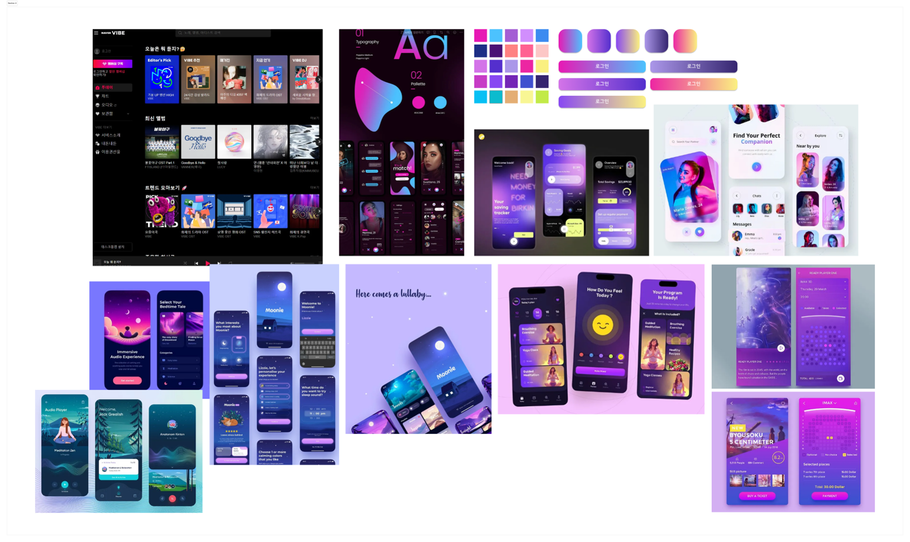
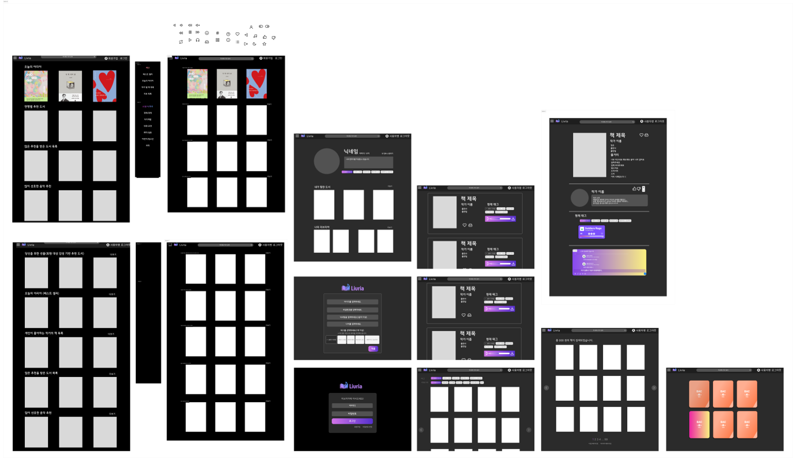

# 🎼 Livria: 노래하듯 읽는 책
> 감성 기반 맞춤형 도서 추천 웹 플랫폼

 
<!--
  팀 소개
-->

##  1. 팀원 소개 및 역할 분담
<h2 align="center">✨ SSACRABUILD 팀원 소개 ✨</h2>

<table align="center" cellpadding="0" cellspacing="0" width="800">
  <tr>
    <!-- 양재원 프로필 -->
    <td align="center"
        style="border:1px solid #ccc; border-radius:10px; padding:10px; box-shadow:2px 2px 5px #aaa;">
       
      <strong>양재원</strong> 
      <a href="https://github.com/JW0304">JW0304</a>
    </td>
    <!-- 역할 칸 -->
    <td valign="top"
        style="border:1px solid #ccc; border-radius:10px; padding:10px; box-shadow:2px 2px 5px #aaa; width:150px;">
      <strong>주 담당 프론트엔드 (Vue)</strong> 
      • Figma 기반 UI/UX 
      • 반응형 레이아웃 
      • Axios 연동 
      • 음악 추천 UI 
      • 페이지별 Vue 구성
    </td>
    <!-- 사람 사이 텀 -->
    <td width="20"></td>
    <!-- 임유나 프로필 -->
    <td align="center"
        style="border:1px solid #ccc; border-radius:10px; padding:10px; box-shadow:2px 2px 5px #aaa;">
       
      <strong>임유나</strong> 
      <a href="https://github.com/harinme">harinme</a>
    </td>
    <!-- 역할 칸 -->
    <td valign="top"
        style="border:1px solid #ccc; border-radius:10px; padding:10px; box-shadow:2px 2px 5px #aaa; width:150px;">
      <strong>주 담당 백엔드 (Django)</strong> 
      • 도서/유저/리뷰 모델 및 API 
      • 도서 추천 알고리즘 
      • 음악/도서 생성형 AI 연동 
      • DB 모델링
    </td>
  </tr>
</table>

<table align="center" cellpadding="5" cellspacing="0" width="800px">
  <tr>
    <th align="center">공동 작업</th>
  </tr>
  <tr>
    <td>
      <ul>
        <li>프론트엔드↔백엔드 크로스 기능 지원
          <ul>
            <li>프론트엔드 담당(양재원): 백엔드 API 연동 및 DB 모델링 지원</li>
            <li>백엔드 담당(임유나): 프론트엔드 UI/UX 구현 및 Axios 연동 지원</li>
          </ul>
        </li>
        <li>GitHub 브랜치 협업 및 코드 리뷰</li>
        <li>Notion을 활용한 프로젝트 문서화</li>
        <li>API 연결 테스트 및 디버깅</li>
      </ul>
    </td>
  </tr>
</table>

 
 
 
 

## 2. 프로젝트 소개
> ### 🚀 프로젝트 개발 배경

 

> 관련 신문 기사 스크랩

  
  &nbsp;&nbsp;
  

> “올해 트렌드는 ‘야외 독서’…‘텍스트 힙’ 유행 발맞추는 지자체들”  
> — 오유림, *한국경제*, 2025-05-11  [원문 보기](https://www.hankyung.com/article/202505114926i)  
>
> “직장인 출퇴근에 하루 평균 1시간14분 써…30대 통근 시간 가장 길어”  
> — 박상영, *경향신문*, 2024-12-20  [원문 보기](https://www.khan.co.kr/article/202412201422001)

<table align="center" width="700" cellpadding="10" cellspacing="0">
  <tr>
    <td align="left">
      <h4>현대인의 라이프스타일 변화와 미디어 소비 패턴을 살펴보면:</h4>
      <ul>
        <li><strong>야외 독서 및 ‘텍스트 힙’(Text Hip) 문화 확산</strong>
          <ul>
            <li>SNS와 뉴스 기사에서 “야외 독서”가 새로운 트렌드로 부상</li>
            <li>독서 공간의 자유로움과 감성 소비 니즈 증대</li>
          </ul>
        </li>
        <li><strong>출퇴근 시간의 활용도 증가</strong>
          <ul>
            <li>직장인 하루 평균 출퇴근 시간 1시간 이상</li>
            <li>이동 중 ‘짧고 굵은’ 콘텐츠 소비 수요 확대</li>
          </ul>
        </li>
        <li><strong>기존 추천 서비스의 한계</strong>
          <ul>
            <li>사용자 감성과 취향을 반영한 콘텐츠 큐레이션 부족</li>
            <li>독서와 음악을 연동한 감성 기반 경험 미흡</li>
          </ul>
        </li>
      </ul>
    </td>
  </tr>
</table>

 

> 이런 배경에서 **Livria**는  
> “책(Livre)과 노래(Aria)를 결합한 감성 기반 도서·음악 추천 플랫폼”으로 사용자의 일상 속 짧은 여유 시간에도 감성에 딱 맞는 큐레이션을 제공합니다.  

 
 

> ### 로고 및 프로젝트 명

<!--
로고 
-->

  
  &nbsp;&nbsp;
  

<h2 align="center">
  책(Livre) + 노래(Aria)를 결합한 감성 기반 도서 추천 플랫폼
</h2>

> ### 개발 기간

 
 

> ###

 
 

> ###

 
 
## 2. 목표 서비스와 구현 정도

| 기능 | 구현 |
|------|------------|
| 사용자 인증 (회원가입/로그인 등) | O |
| 도서 / 리뷰 CRUD | O |
| 좋아요 / 댓글 기능 | O (좋아요한 도서 모아보기 구현) |
| 도서 추천 기능 | O |
| 음악 추천 기능 | △ (도서별 음악 추천 구현) |
| 반응형 웹 (모바일 대응) | △ (일부 구현, 개선 예정) |
| AI 기반 음악 커버 이미지 생성 | X (향후 구현 예정) |
| 화이트모드, 소셜 로그인 등 | X (향후 구현 예정) |

---

## 3. 데이터베이스 모델링 (ERD)

> 주요 테이블: User, Book, Category (M:N), Review, Music, Review

---

## 4. 도서 추천 알고리즘 설명

- **임베딩 기반 추천 (유사도 분석)**  
  → 도서 제목과 설명을 벡터화 후 코사인 유사도 계산  
  → 상위 4개의 유사 도서를 자동 추천

- **GPT 기반 선호 도서 맞춤형 추천**  
  → 사용자 선호 도서에 맞춰 어울리는 음악과 함께 추천

---

## 5. 핵심 기능 요약

- 메인 페이지: 로그인 여부에 따라 추천 콘텐츠 차별화
- 검색 기능, 사이드바 네비게이션
- 도서 상세 페이지에서 음악 생성/추천
- 리뷰 작성 및 전체 조회 기능
- 프로필 정보 수정 및 감정 태그 UI 제공

---

## 6. 생성형 AI 활용

- **Wikipedia**: 작가 정보 탐색
- **OpenAI GPT API**: 작가 정보 생성
- **Aladin**: 도서 데이터 생성
- **MusicGen**: 도서 분위기 기반 음악 생성
- **Upstage API**: 선호 도서 기반 도서 추천

---

## 7. 느낀점

- **임유나**: 촉박한 시간에 기획부터 구현까지 모든 과정을 압축적으로 진행하다 보니, 처음 구상했던 기능들을 모두 구현하지 못한 점이 가장 아쉬웠습니다. 특히 추천 알고리즘과 AI 연동, 음악 생성 및 추가적인 기능들 구현처럼 기술적으로 흥미로운 요소들을 더 깊이 다루고 싶었지만, 일정에 쫓겨 핵심만 구현해야 했습니다. 하지만 힘들었던 만큼 팀원과 함께 문제를 해결하고 완성해나가는 과정이 재밌고 값진 경험이었고, 백엔드 전체 흐름을 직접 설계하고 연결하는 과정에서 많은 걸 배울 수 있었습니다. 다음에 프로젝트를 이어서 진행할 때는 더 여유 있는 일정 속에서, 미처 시도하지 못한 기능까지 완성해보고 싶습니다.

- **양재원**: 짧은 기간 안에 프로젝트를 완성하다 보니 아쉬운 점도 있었지만, Django와 Vue를 비롯해 다양한 개발 도구를 실제로 활용하며 많은 것을 배울 수 있는 값진 경험이었습니다. 프론트와 백엔드를 나누어 협업하면서 역할 분담의 중요성을 느꼈고, 팀원과의 소통과 기획 과정에서도 큰 도움을 받아 고마운 마음이 들었고, 앞으로도 함께 으쌰으쌰하고 싶습니다. 마지막으로, 이번 프로젝트를 통해 평소에 백엔드와 프론트엔드 기술, 그리고 협업 도구들에 대한 지식과 경험을 꾸준히 쌓아두는 것이 중요하다는 점을 절실히 깨달았습니다.

---

## 8. 기타

- 기술 스택
| 분야 | 도구 |
| --- | --- |
| Backend | Django, SQLite |
| Frontend | Vue.js, JavaScript, CSS, HTML |
| DevOps | Git, GitHub |
| Tools | VS Code, Postman, Figma, Notion, Excalidraw |

- 피그마 목업

---

